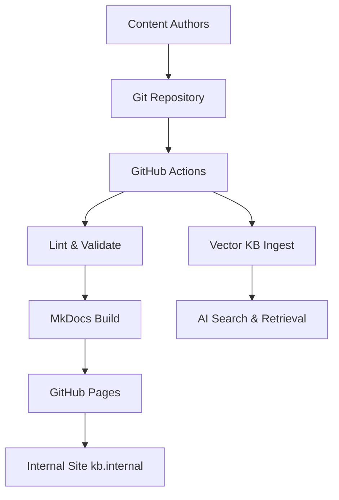
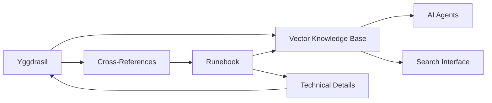

# Yggdrasil Architecture

## Executive Summary

Yggdrasil employs a **domain-driven organizational architecture** that mirrors how teams actually think about and access institutional knowledge. The system is built on a foundation of structured content management with automated publishing and intelligent search capabilities.

## System Architecture

### Core Architectural Principles

1. **Domain Separation**: Content organized by organizational function (strategy, people, governance, processes)
2. **Metadata-Driven**: Front-matter contracts ensure consistent structure and discoverability
3. **Automation-First**: Minimal manual overhead through CI/CD integration
4. **Cross-System Integration**: Seamless linking between organizational (Yggdrasil) and technical (Runebook) knowledge

### Directory Architecture

```
yggdrasil/
├── README.md                     # Repository overview and navigation guide
├── 00-meta/                      # Repository metadata and governance
│   ├── glossary.md              # Terminology and schema definitions
│   ├── changelog.md             # Repository evolution history
│   └── schema_version.yml       # Metadata schema versioning
├── 01-projects/                  # Project-level executive summaries
│   ├── index.md                 # Auto-generated project index
│   ├── crypto-maester.md        # Links to Runebook technical docs
│   ├── ishtar.md                # Frontend platform overview
│   ├── silver-city.md           # Microservices ecosystem summary
│   └── yggdrasil.md             # This repository's project page
├── 02-team/                      # People and organizational structure
│   ├── mission-vision-core-values.md
│   ├── roles-responsibilities.md
│   ├── org-chart.md             # Visual organizational hierarchy
│   └── members/                 # Individual team member profiles
│       ├── index.md             # Auto-generated member roster
│       ├── kwon-tae-yeon.md     # Individual member bio pages
│       └── template.md          # New member bio template
├── 03-policies/                  # Governance and compliance
│   ├── index.md                 # Policy overview and hierarchy
│   ├── technical/               # Technical governance
│   │   ├── ci-cd-policy.md
│   │   ├── coding-conventions.md
│   │   ├── security-policy.md
│   │   └── architecture-standards.md
│   ├── operational/             # Operational policies
│   │   ├── data-retention.md
│   │   ├── incident-response.md
│   │   └── compliance-framework.md
│   └── hr/                      # Human resources policies
│       ├── code-of-conduct.md
│       ├── remote-work-policy.md
│       └── performance-management.md
├── 04-processes/                 # Standard operating procedures
│   ├── index.md                 # Process overview and workflow maps
│   ├── product-planning/        # Product development processes
│   │   ├── pr-faq-methodology.md
│   │   ├── feature-prioritization.md
│   │   └── user-research-sop.md
│   ├── execution/               # Delivery and execution processes
│   │   ├── agile-work-management.md
│   │   ├── sprint-ceremonies.md
│   │   ├── code-review-process.md
│   │   └── deployment-procedures.md
│   ├── culture/                 # People and culture processes
│   │   ├── hiring-sop.md
│   │   ├── onboarding-process.md
│   │   ├── evaluation-sop.md
│   │   └── team-building.md
│   └── _archive/                # Retired processes (excluded from site)
├── 05-templates/                 # Standardized document templates
│   ├── index.md                 # Template catalog and usage guide
│   ├── adr-template.md          # Architecture Decision Record template
│   ├── okr-template.md          # Objectives and Key Results template
│   ├── sop-template.md          # Standard Operating Procedure template
│   ├── member-bio-template.md   # Team member biography template
│   └── project-summary-template.md
├── .github/                      # CI/CD and automation
│   └── workflows/
│       ├── lint.yml             # Content validation on PRs
│       ├── site.yml             # MkDocs build and deployment
│       ├── roster.yml           # Nightly member roster updates
│       └── kb-ingest.yml        # Vector knowledge base synchronization
├── .markdownlint.yml            # Markdown linting configuration
├── mkdocs.yml                   # MkDocs site configuration
└── requirements.txt             # Python dependencies for site generation
```

## Data Architecture

### Front-Matter Schema

All content files enforce a standardized YAML front-matter structure:

```yaml
---
title: "Document Title"
owners: ["engineering-leads@company.com"]
last_updated: "2025-07-19"
tags: ["process", "agile", "execution"]
version: "1.2"
domain: "processes"  # strategy|people|governance|processes|templates|projects
status: "active"     # active|draft|archived
approval_required: false  # true for policy changes
---
```

### Metadata Governance

- **Ownership**: Every document has designated owners responsible for maintenance
- **Currency**: Last updated timestamps enforce content freshness
- **Classification**: Tags and domain classification enable intelligent filtering
- **Versioning**: Document version tracking for change management
- **Approval Workflow**: Policy changes trigger additional review requirements

## Component Architecture

### Publishing Pipeline



### Integration Architecture



## Data Flow Architecture

### Content Lifecycle

1. **Creation**: Authors create/edit Markdown files with required front-matter
2. **Validation**: CI pipeline validates structure, links, and metadata
3. **Review**: Human review process with domain expert approval
4. **Publishing**: Automated build and deployment to internal site
5. **Indexing**: Content ingested into vector knowledge base
6. **Maintenance**: Automated freshness monitoring and update alerts

### Search and Discovery

1. **Human Access**: Browse via GitHub, internal MkDocs site, or search interface
2. **Agent Access**: Programmatic queries to vector knowledge base with domain filtering
3. **Cross-References**: Dynamic linking between organizational and technical content
4. **Analytics**: Usage tracking for content optimization and pruning

## Security Architecture

### Access Control

- **Repository Access**: GitHub organization membership and team-based permissions
- **Content Classification**: Internal-only designation with clear confidentiality marking
- **PII Protection**: Explicit guidance to redact personally identifiable information
- **Audit Trail**: Complete version control history of all content changes

### Content Validation

- **Link Integrity**: Automated validation of internal and external links
- **Structure Compliance**: Front-matter schema enforcement
- **Quality Gates**: Markdown linting and YAML validation
- **Approval Workflows**: Multi-stage review for policy-sensitive content

## Scalability Architecture

### Content Organization

- **Hierarchical Structure**: Logical nesting prevents content sprawl
- **Archive Strategy**: Systematic retirement of obsolete content
- **Template System**: Standardized formats reduce cognitive load
- **Cross-Linking**: Intelligent reference system prevents duplication

### Technical Scalability

- **Static Site Generation**: Fast, cacheable content delivery
- **Vector Search**: Semantic search scales with content volume
- **Automated Workflows**: Reduced manual overhead as content grows
- **Modular Architecture**: Domain separation enables distributed ownership
