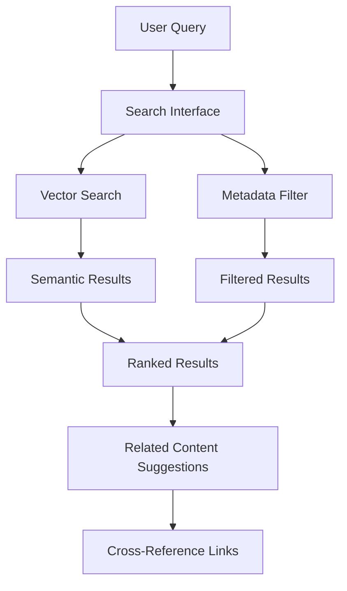

# Yggdrasil Interfaces

## Executive Summary

Yggdrasil provides multiple interface layers to accommodate different user types and access patterns - from human browsing to programmatic AI agent queries. The system prioritizes discoverability, accessibility, and integration with existing workflows.

## Human Interfaces

### Web-Based Documentation Site

**URL**: https://kb.internal  
**Technology**: MkDocs + Material Theme  
**Features**:
- **Responsive Design**: Optimized for desktop, tablet, and mobile access
- **Built-in Search**: Full-text search across all content with result highlighting
- **Navigation Hierarchy**: Collapsible tree navigation reflecting directory structure
- **Tag-Based Filtering**: Dynamic content filtering by domain, type, and custom tags
- **Cross-References**: Clickable links between related organizational and technical content
- **Analytics Dashboard**: Most viewed and stale content identification

### GitHub Repository Interface

**URL**: GitHub organization repository  
**Features**:
- **Raw Content Access**: Direct Markdown viewing and editing in GitHub UI
- **Version History**: Complete commit history and diff viewing for all content
- **Collaborative Editing**: Pull request workflow for content contributions
- **Issue Tracking**: Content feedback and improvement suggestions
- **Release Management**: Tagged releases for major handbook updates

### Content Management Workflows

#### Content Creation Interface
```yaml
# Required front-matter for all content
---
title: "Document Title"
owners: ["team@company.com"]
last_updated: "2025-07-19"
tags: ["domain", "type", "topic"]
version: "1.0"
domain: "processes"
status: "active"
approval_required: false
---
```

#### Review and Approval Interface
- **Pull Request Reviews**: Human reviewers validate content accuracy and compliance
- **Policy Change Workflow**: Enhanced approval process for governance-sensitive content
- **Automated Validation**: CI/CD checks for metadata completeness and link integrity

## Programmatic Interfaces

### Vector Knowledge Base API

**Primary Use**: AI agent and automation access  
**Authentication**: API key-based with rate limiting

#### Search Interface
```python
# Basic semantic search
results = yggdrasil_kb.search(
    query="What is our hiring process?",
    limit=10
)

# Domain-filtered search
results = yggdrasil_kb.search(
    query="security policies",
    filters={
        "domain": "governance",
        "tags": ["security", "policy"],
        "status": "active"
    }
)

# Advanced query with metadata
results = yggdrasil_kb.search(
    query="agile ceremonies",
    filters={"domain": "processes"},
    metadata_fields=["owners", "last_updated", "version"]
)
```

#### Collection Structure
```python
# Yggdrasil content is indexed with prefixed collection names
collections = [
    "yggdrasil-strategy",    # Mission, vision, values
    "yggdrasil-people",      # Team information and roles
    "yggdrasil-governance",  # Policies and standards
    "yggdrasil-processes",   # SOPs and workflows
    "yggdrasil-templates",   # Document templates
    "yggdrasil-projects"     # Project summaries
]
```

### REST API Endpoints

#### Content Retrieval
```http
GET /api/v1/content/{domain}/{path}
Authorization: Bearer {api_token}

# Example: Retrieve coding conventions
GET /api/v1/content/governance/technical/coding-conventions.md
```

#### Metadata Queries
```http
GET /api/v1/metadata/search?domain=processes&status=active
Authorization: Bearer {api_token}

# Response format
{
  "results": [
    {
      "path": "04-processes/execution/agile-work-management.md",
      "title": "Agile Work Management SOP",
      "owners": ["engineering-leads@company.com"],
      "last_updated": "2025-07-19",
      "tags": ["process", "agile", "execution"],
      "domain": "processes"
    }
  ]
}
```

## Integration Interfaces

### Runebook Cross-Reference System

**Bidirectional Linking**: Seamless navigation between organizational and technical documentation

#### From Yggdrasil to Runebook
```markdown
# Project Overview: Crypto-Maester
Executive summary and business context...

## Technical Details
For detailed architecture and implementation:
- [System Architecture](../runebook/crypto-maester/architecture.md)
- [API Documentation](../runebook/crypto-maester/interfaces.md)
- [Deployment Guide](../runebook/crypto-maester/workflows.md)
```

#### From Runebook to Yggdrasil
```markdown
# Crypto-Maester Architecture
Technical implementation details...

## Organizational Context
- [Project Mission & Goals](../yggdrasil/01-projects/crypto-maester.md)
- [Team Responsibilities](../yggdrasil/02-team/roles-responsibilities.md)
- [Coding Standards](../yggdrasil/03-policies/technical/coding-conventions.md)
```

### CI/CD Integration Interfaces

#### GitHub Actions Integration
```yaml
# .github/workflows/content-validation.yml
name: Content Validation
on: [pull_request]
jobs:
  validate:
    steps:
      - name: Validate front-matter
        run: python scripts/validate_metadata.py
      - name: Check link integrity
        run: markdown-link-check **/*.md
      - name: Lint markdown
        run: markdownlint **/*.md
```

#### Knowledge Base Synchronization
```yaml
# .github/workflows/kb-sync.yml
name: KB Synchronization
on:
  push:
    branches: [main]
jobs:
  sync:
    steps:
      - name: Ingest to Vector KB
        run: |
          python scripts/kb_ingest.py \
            --collection-prefix "yggdrasil-" \
            --source-dir . \
            --api-key ${{ secrets.KB_API_KEY }}
```

## User Experience Interfaces

### Onboarding Interface

**New Team Member Journey**:
1. **Welcome Page**: Mission, vision, and core values introduction
2. **Role Assignment**: Automatic routing to relevant role-specific content  
3. **Resource Discovery**: Guided tour of available knowledge domains
4. **Bio Creation**: Template-driven personal profile setup
5. **Integration Setup**: Access provisioning for all interfaces

### Search and Discovery Interface

#### Advanced Search Features
- **Faceted Search**: Filter by domain, owner, date range, content type
- **Saved Searches**: Bookmark frequently accessed queries
- **Search History**: Personal search pattern tracking
- **Suggested Content**: AI-powered content recommendations based on role and activity

#### Content Relationship Visualization


## Administrative Interfaces

### Content Governance Dashboard

**Access**: Leadership and content owners  
**Features**:
- **Content Freshness Monitoring**: Identify stale content requiring updates
- **Ownership Tracking**: Contact owners of outdated or problematic content  
- **Usage Analytics**: Most and least accessed content identification
- **Compliance Reporting**: Policy adherence and approval status tracking

### Maintenance Interface

```bash
# Content validation tools
make lint                    # Run all content validation checks
make dead-links             # Identify broken internal/external links
make stale-content          # Report content older than 6 months
make metadata-audit         # Validate front-matter compliance

# Site management
make build-site             # Local MkDocs build for testing
make deploy-site            # Deploy to internal hosting
make backup-content         # Create versioned content backup
```
