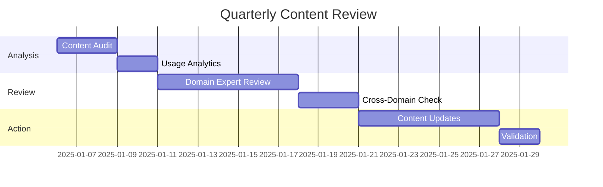

# Yggdrasil Maintenance

## Executive Summary

This document provides comprehensive operational procedures for maintaining Yggdrasil as a reliable, current, and valuable organizational knowledge repository. Regular maintenance ensures content quality, system performance, and user satisfaction while minimizing technical debt and organizational friction.

## Daily Maintenance Operations

### Automated Daily Tasks

#### Content Validation (6:00 AM UTC)
```bash
# Automated link validation
make validate-links

# Metadata compliance check
python scripts/validate_metadata.py --strict

# Broken reference detection
python scripts/check_cross_references.py --fix-auto
```

#### Usage Analytics Collection (11:59 PM UTC)
- Site traffic and page view statistics
- Search query analysis and trending topics
- User feedback and issue tracking
- Performance metrics and load times

### Manual Daily Monitoring

#### Content Health Check
```bash
# Check for content requiring attention
make content-health-report

# Review recent changes and contributions
git log --since="1 day ago" --pretty=format:"%h - %s (%an, %ar)"

# Monitor CI/CD pipeline status
gh workflow list --repo organization/yggdrasil
```

#### User Feedback Review
- GitHub issues and comments
- Slack feedback and questions
- Email notifications and requests
- Analytics-driven improvement opportunities

## Weekly Maintenance Operations

### Content Freshness Audit (Sundays)

#### Stale Content Identification
```python
# Automated freshness audit
def weekly_freshness_audit():
    stale_content = identify_stale_content(
        threshold_days=180,  # 6 months
        exclude_archived=True
    )
    
    generate_freshness_report(stale_content)
    notify_content_owners(stale_content)
    create_maintenance_issues(stale_content)
```

#### Owner Notification Process
1. **Automated Email**: Content owners receive stale content alerts
2. **Slack Notifications**: Channel alerts for team-wide content issues
3. **GitHub Issues**: Tracking issues created for content requiring updates
4. **Dashboard Updates**: Analytics dashboard reflects content health status

### Cross-Reference Validation

#### Runebook Integration Check
```bash
# Validate cross-references to technical documentation
python scripts/validate_runebook_links.py \
  --runebook-repo ../runebook \
  --yggdrasil-repo . \
  --check-bidirectional \
  --report-missing

# Update project summary links
python scripts/sync_project_summaries.py \
  --source ../runebook/projects \
  --target 01-projects/ \
  --create-missing
```

## Monthly Maintenance Operations

### Comprehensive Content Review

#### Content Quality Assessment
```bash
# Generate comprehensive quality report
make quality-report

# Analyze content usage patterns
python scripts/usage_analytics.py \
  --period 30d \
  --generate-insights \
  --recommend-actions
```

#### Performance Optimization
```bash
# Site build optimization
mkdocs build --strict --verbose --profile

# Search index optimization
python scripts/optimize_search_index.py \
  --rebuild-index \
  --update-weights \
  --validate-performance
```

### User Experience Optimization

#### Navigation and Discovery
- Review site navigation effectiveness
- Analyze user journey patterns
- Optimize content categorization and tagging
- Update search result ranking algorithms

#### Mobile and Accessibility
- Test mobile responsiveness across devices
- Validate accessibility compliance (WCAG 2.1)
- Optimize page load times and performance
- Review and update PWA capabilities

## Quarterly Maintenance Operations

### Major Content Review (First Monday of Quarter)

#### Strategic Content Alignment


#### Schema Evolution Process
1. **Usage Analysis**: Review metadata usage and effectiveness
2. **Schema Proposal**: Draft changes to front-matter requirements
3. **Impact Assessment**: Analyze migration effort and breaking changes
4. **Community Feedback**: Gather input from content owners and users
5. **Migration Implementation**: Automated migration with validation
6. **Schema Version Update**: Bump version in `00-meta/schema_version.yml`

### Infrastructure Maintenance

#### System Updates and Security
```bash
# Update dependencies and security patches
pip install --upgrade -r requirements.txt
npm audit fix

# Review and update CI/CD pipelines
gh workflow run update-dependencies.yml

# Security audit and vulnerability assessment
python scripts/security_audit.py --comprehensive
```

#### Backup and Disaster Recovery
```bash
# Create comprehensive backup
python scripts/backup_yggdrasil.py \
  --include-git-history \
  --include-analytics \
  --include-user-data \
  --compress \
  --encrypt

# Test disaster recovery procedures
python scripts/test_disaster_recovery.py \
  --simulate-data-loss \
  --validate-restoration \
  --performance-benchmark
```

## Annual Maintenance Operations

### Comprehensive System Overhaul

#### Architecture Review and Optimization
- Evaluate current directory structure effectiveness
- Assess automation workflow efficiency
- Review integration points and dependencies
- Plan major feature additions and improvements

#### Content Lifecycle Management
```bash
# Annual content archival process
python scripts/annual_archival.py \
  --archive-inactive \
  --preserve-history \
  --update-references \
  --notify-stakeholders

# Knowledge base optimization
python scripts/optimize_knowledge_base.py \
  --rebuild-vectors \
  --update-embeddings \
  --optimize-search \
  --validate-accuracy
```

## Content Governance Operations

### Ownership and Accountability

#### Owner Audit and Updates
```python
# Validate content ownership
def audit_content_ownership():
    orphaned_content = find_orphaned_content()
    invalid_owners = validate_owner_emails()
    inactive_owners = check_owner_activity()
    
    return {
        'orphaned': orphaned_content,
        'invalid': invalid_owners,
        'inactive': inactive_owners
    }
```

#### Policy Compliance Monitoring
- Review adherence to content standards
- Audit front-matter compliance across all documents
- Validate approval workflows for policy changes
- Monitor and report on governance violations

### Quality Assurance Operations

#### Content Standards Enforcement
```bash
# Comprehensive content validation
make lint-all  # Markdown, YAML, and link validation
make style-check  # Style guide compliance
make accessibility-check  # Accessibility standards
make seo-check  # Search optimization validation
```

#### Template and Standardization Updates
- Review and update document templates
- Assess template usage and effectiveness
- Create new templates for emerging content types
- Deprecate unused or ineffective templates

## Troubleshooting and Issue Resolution

### Common Issues and Solutions

#### Build Failures
```bash
# Diagnose build issues
mkdocs build --verbose --strict 2>&1 | tee build.log
python scripts/diagnose_build_issues.py --log build.log

# Common fixes
git clean -fd  # Clean untracked files
pip install --force-reinstall -r requirements.txt
```

#### Search Index Problems
```bash
# Rebuild search index
python scripts/rebuild_search_index.py \
  --clear-existing \
  --batch-size 50 \
  --validate-completion

# Verify search functionality
python scripts/test_search_functionality.py \
  --run-test-queries \
  --validate-results \
  --performance-benchmark
```

#### Cross-Reference Breakage
```bash
# Fix broken cross-references
python scripts/fix_broken_references.py \
  --auto-fix-internal \
  --report-external \
  --update-redirects \
  --validate-fixes
```

### Escalation Procedures

#### Emergency Content Updates
1. **Emergency Label**: Apply emergency label to critical issues
2. **Fast-Track Review**: Bypass normal review for urgent updates
3. **Immediate Deployment**: Deploy critical fixes within 1 hour SLA
4. **Post-Emergency Validation**: Comprehensive quality check after deployment

#### System Outages
1. **Incident Declaration**: Formal incident declaration and stakeholder notification
2. **Rollback Procedures**: Automated rollback to last known good state
3. **Root Cause Analysis**: Comprehensive incident investigation and documentation
4. **Process Improvement**: Update procedures based on incident learnings

## Performance Monitoring and Optimization

### Key Performance Indicators

#### Site Performance Metrics
- **Page Load Time**: Target < 2 seconds for all pages
- **Search Response Time**: Target < 500ms for search queries
- **Build Time**: Target < 5 minutes for full site rebuild
- **Uptime**: Target 99.9% availability for kb.internal

#### Content Quality Metrics
- **Content Freshness**: Target 90% of content updated within 6 months
- **Link Integrity**: Target 99% of links functional and accessible
- **Metadata Compliance**: Target 100% front-matter compliance
- **User Satisfaction**: Target 4.5/5.0 user satisfaction rating

### Optimization Strategies

#### Performance Optimization
```bash
# Site performance optimization
python scripts/optimize_performance.py \
  --compress-images \
  --minify-assets \
  --optimize-search \
  --cache-optimization

# Analytics and monitoring setup
python scripts/setup_monitoring.py \
  --enable-analytics \
  --configure-alerts \
  --setup-dashboards
```

## Maintenance Tools and Scripts

### Essential Maintenance Commands

```bash
# Daily operations
make daily-health-check      # Comprehensive daily validation
make update-analytics       # Update usage and performance metrics
make validate-content       # Content validation and compliance

# Weekly operations
make weekly-audit           # Comprehensive weekly content audit
make freshness-report       # Stale content identification and reporting
make cross-reference-check  # Validate all cross-references

# Monthly operations
make monthly-optimization   # Performance and content optimization
make backup-create         # Create comprehensive backup
make security-audit        # Security assessment and updates

# Quarterly operations
make quarterly-review      # Major content and system review
make schema-evolution      # Schema updates and migration
make disaster-recovery-test # Test backup and recovery procedures
```

### Custom Maintenance Scripts

#### Content Management Scripts
- `scripts/validate_metadata.py` - Front-matter validation and compliance
- `scripts/check_cross_references.py` - Cross-reference integrity validation
- `scripts/generate_member_index.py` - Automated member roster generation
- `scripts/audit_content_freshness.py` - Stale content identification

#### System Maintenance Scripts
- `scripts/optimize_search_index.py` - Search performance optimization
- `scripts/backup_yggdrasil.py` - Comprehensive backup creation
- `scripts/security_audit.py` - Security assessment and reporting
- `scripts/performance_monitor.py` - Performance metrics collection

This comprehensive maintenance guide ensures Yggdrasil remains a reliable, high-quality organizational knowledge repository that effectively serves the team's information needs while maintaining operational excellence.
