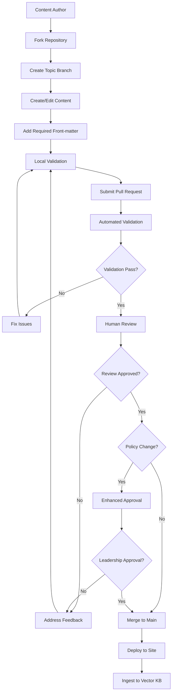
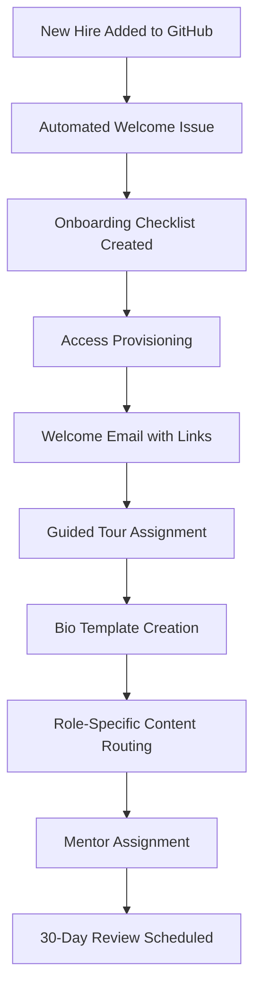
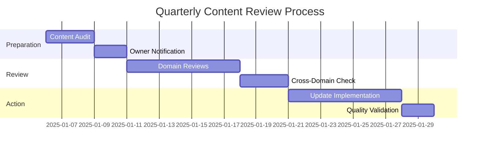

# Yggdrasil Workflows

## Executive Summary

Yggdrasil employs automated workflows to maintain content quality, ensure organizational knowledge stays current, and streamline both human and system interactions with the living handbook. These workflows span content creation, validation, publishing, and maintenance processes.

## Content Management Workflows

### Content Creation and Review Workflow



### Policy Change Workflow

**Enhanced approval process for governance-sensitive content**:

1. **Policy Label Detection**: Automated labeling of PRs affecting 03-policies/ directory
2. **Stakeholder Notification**: Slack notifications to relevant leadership groups
3. **Extended Review Period**: Minimum 48-hour review window for policy changes
4. **Approval Requirements**: Multiple reviewers from different teams required
5. **Change Documentation**: Automatic changelog entry generation
6. **Communication Plan**: Announcement to all teams upon policy activation

## Automated Workflows

### CI/CD Pipeline Workflows

#### Content Validation Workflow (lint.yml)
**Trigger**: Pull Request  
**Duration**: ~2-3 minutes  

```yaml
name: Content Validation
on: [pull_request]
jobs:
  validate-structure:
    runs-on: ubuntu-latest
    steps:
      - name: Checkout code
        uses: actions/checkout@v3
      
      - name: Validate front-matter
        run: |
          python scripts/validate_metadata.py \
            --check-owners \
            --check-dates \
            --check-required-fields
      
      - name: Lint markdown
        uses: DavidAnson/markdownlint-cli2-action@v9
        with:
          globs: '**/*.md'
      
      - name: Validate YAML
        run: yamllint **/*.yml **/*.yaml
      
      - name: Check link integrity
        run: |
          markdown-link-check **/*.md \
            --config .markdown-link-check.json
      
      - name: Validate directory structure
        run: python scripts/validate_structure.py
```

#### Site Deployment Workflow (site.yml)
**Trigger**: Push to main branch  
**Duration**: ~5-7 minutes  

```yaml
name: Deploy Documentation Site
on:
  push:
    branches: [main]
jobs:
  deploy:
    runs-on: ubuntu-latest
    steps:
      - name: Checkout code
        uses: actions/checkout@v3
        with:
          fetch-depth: 0  # Full history for change detection
      
      - name: Setup Python
        uses: actions/setup-python@v4
        with:
          python-version: '3.9'
      
      - name: Install dependencies
        run: pip install -r requirements.txt
      
      - name: Build MkDocs site
        run: |
          mkdocs build --strict --verbose
      
      - name: Deploy to GitHub Pages
        uses: peaceiris/actions-gh-pages@v3
        with:
          github_token: ${{ secrets.GITHUB_TOKEN }}
          publish_dir: ./site
          custom_domain: kb.internal
      
      - name: Trigger KB ingestion
        run: |
          curl -X POST ${{ secrets.KB_WEBHOOK_URL }} \
            -H "Authorization: Bearer ${{ secrets.KB_API_KEY }}" \
            -H "Content-Type: application/json" \
            -d '{"source": "yggdrasil", "trigger": "site_deploy"}'
```

#### Member Roster Update Workflow (roster.yml)
**Trigger**: Nightly at 2:00 AM UTC  
**Duration**: ~1-2 minutes  

```yaml
name: Update Member Roster
on:
  schedule:
    - cron: '0 2 * * *'  # Daily at 2 AM UTC
  workflow_dispatch:  # Manual trigger option
jobs:
  update-roster:
    runs-on: ubuntu-latest
    steps:
      - name: Checkout code
        uses: actions/checkout@v3
      
      - name: Generate member index
        run: |
          python scripts/generate_member_index.py \
            --source-dir 02-team/members/ \
            --output 02-team/members/index.md \
            --template scripts/templates/member_index.jinja
      
      - name: Check for missing bios
        run: |
          python scripts/audit_member_bios.py \
            --github-org ${{ secrets.GITHUB_ORG }} \
            --members-dir 02-team/members/ \
            --slack-webhook ${{ secrets.SLACK_WEBHOOK }}
      
      - name: Commit roster updates
        run: |
          git config --local user.email "action@github.com"
          git config --local user.name "GitHub Action"
          git add 02-team/members/index.md
          git commit -m "chore: update member roster" || exit 0
          git push
```

#### Knowledge Base Synchronization Workflow (kb-sync.yml)
**Trigger**: Site deployment completion  
**Duration**: ~3-5 minutes  

```yaml
name: Sync to Knowledge Base
on:
  workflow_run:
    workflows: ["Deploy Documentation Site"]
    types: [completed]
jobs:
  sync-kb:
    if: ${{ github.event.workflow_run.conclusion == 'success' }}
    runs-on: ubuntu-latest
    steps:
      - name: Checkout code
        uses: actions/checkout@v3
      
      - name: Prepare content for ingestion
        run: |
          python scripts/prepare_kb_content.py \
            --source-dir . \
            --output-dir /tmp/kb_content \
            --add-metadata \
            --collection-prefix "yggdrasil-"
      
      - name: Ingest to vector KB
        run: |
          python scripts/kb_ingest.py \
            --content-dir /tmp/kb_content \
            --api-endpoint ${{ secrets.KB_API_ENDPOINT }} \
            --api-key ${{ secrets.KB_API_KEY }} \
            --batch-size 10 \
            --update-existing
      
      - name: Validate ingestion
        run: |
          python scripts/validate_kb_sync.py \
            --api-endpoint ${{ secrets.KB_API_ENDPOINT }} \
            --api-key ${{ secrets.KB_API_KEY }} \
            --expected-collections "yggdrasil-strategy,yggdrasil-people,yggdrasil-governance,yggdrasil-processes,yggdrasil-templates,yggdrasil-projects"
```

## User Interaction Workflows

### New Team Member Onboarding Workflow



#### Onboarding Steps
1. **Automated Detection**: New GitHub organization members trigger onboarding workflow
2. **Welcome Package**: Personalized email with kb.internal access and initial reading list
3. **Guided Tour**: Interactive walkthrough of key organizational knowledge areas
4. **Bio Creation**: Template-driven process for creating personal profile
5. **Role Mapping**: Automatic content recommendations based on role and team assignment
6. **Mentor Connection**: Assignment to organizational mentor for cultural integration
7. **Progress Tracking**: 30, 60, 90-day milestone reviews with knowledge gap assessment

### Content Maintenance Workflows

#### Freshness Monitoring Workflow
**Trigger**: Weekly on Sundays  
**Purpose**: Identify and address stale content  

```python
# Automated content audit process
def audit_content_freshness():
    stale_content = []
    for content_file in find_all_content():
        last_updated = extract_last_updated(content_file)
        if days_since(last_updated) > 180:  # 6 months
            stale_content.append({
                'file': content_file,
                'last_updated': last_updated,
                'owners': extract_owners(content_file),
                'domain': extract_domain(content_file)
            })
    
    if stale_content:
        send_stale_content_report(stale_content)
        create_maintenance_issues(stale_content)
```

#### Link Validation Workflow
**Trigger**: Daily at 6:00 AM UTC  
**Purpose**: Maintain link integrity across all content  

1. **Internal Link Validation**: Verify all relative links point to existing content
2. **External Link Validation**: Check HTTP status of external references
3. **Cross-Reference Validation**: Ensure Runebook links are accessible
4. **Report Generation**: Daily summary of broken links with ownership information
5. **Automated Issue Creation**: GitHub issues created for broken links with auto-assignment to content owners

## Administrative Workflows

### Content Governance Workflow

#### Quarterly Content Review
**Trigger**: First Monday of each quarter  
**Duration**: 2-3 weeks  



#### Annual Schema Evolution
**Trigger**: Annual planning cycle  
**Purpose**: Evolve metadata schema and directory structure  

1. **Usage Analysis**: Review analytics to identify underutilized or missing content categories
2. **Schema Proposal**: Draft changes to front-matter requirements and directory structure
3. **Impact Assessment**: Analyze migration effort and breaking changes
4. **Community Feedback**: Solicit input from content owners and frequent users
5. **Migration Planning**: Develop automated migration scripts and validation tools
6. **Rollout Execution**: Phased implementation with rollback capabilities

### Integration Workflows

#### Runebook Synchronization Workflow
**Trigger**: Changes to project files in either repository  
**Purpose**: Maintain consistent cross-references between organizational and technical documentation  

```python
# Cross-repository synchronization logic
def sync_project_references():
    yggdrasil_projects = get_project_summaries('01-projects/')
    runebook_projects = get_runebook_projects()
    
    # Identify mismatches
    missing_in_yggdrasil = runebook_projects - yggdrasil_projects
    missing_in_runebook = yggdrasil_projects - runebook_projects
    
    # Create sync issues
    for project in missing_in_yggdrasil:
        create_yggdrasil_summary_issue(project)
    
    # Validate existing cross-references
    validate_cross_references()
```

## Quality Assurance Workflows

### Continuous Quality Monitoring

#### Daily Quality Checks
- **Metadata Compliance**: Front-matter validation across all content
- **Link Integrity**: Internal and external link verification
- **Content Structure**: Directory organization and naming convention compliance
- **Search Index Health**: Vector knowledge base consistency validation

#### Weekly Quality Reports
- **Content Analytics**: Most/least accessed content identification
- **Owner Activity**: Content maintenance activity tracking
- **User Feedback**: Issue and comment analysis for improvement opportunities
- **System Performance**: Site load times and search response metrics

### Emergency Response Workflows

#### Critical Content Update Workflow
**Trigger**: Security incident or urgent policy change  
**SLA**: Updates deployed within 1 hour  

1. **Emergency Issue Creation**: High-priority issue with emergency label
2. **Fast-Track Review**: Abbreviated review process with emergency approvers
3. **Immediate Deployment**: Bypass normal validation for critical updates
4. **Notification Cascade**: Automated alerts to all team members
5. **Post-Update Validation**: Comprehensive quality check after emergency deployment
6. **Incident Documentation**: Full incident report and process improvement recommendations

This comprehensive workflow system ensures Yggdrasil remains a reliable, current, and valuable organizational knowledge resource while minimizing manual overhead and maximizing content quality.
